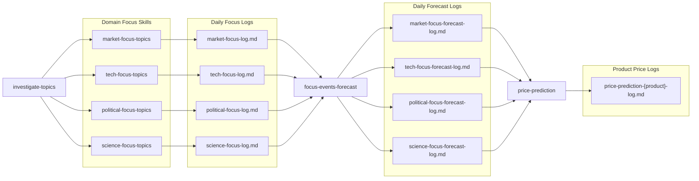

# Finance AI Agent

This repository is for creating an AI agent that supports financial research, market understanding, and investment decision support.

The main purpose of this project is to build a strong prompt foundation for finance-focused reasoning.

## What We Want To Do

We want this AI agent to help with:

- market analysis
- market prediction
- finding correlated data
- asset management
- financial advice support

## Project Goal

The goal is to create an agent that can assist with understanding markets more clearly and turning financial information into useful insights.

This includes the ability to:

- analyze market conditions and major drivers
- summarize risks, opportunities, and uncertainty
- identify relationships between assets, sectors, and macroeconomic signals
- support portfolio thinking and asset allocation decisions
- provide structured financial guidance for research and planning

## Intended Focus

This project is centered on finance prompts that help an AI agent think through:

- price movement and market trends
- bullish, bearish, and neutral scenarios
- correlated indicators and cross-market signals
- diversification, allocation, and portfolio exposure
- financial tradeoffs based on goals, risk, and time horizon

## Boundaries

This project is intended for:

- research
- analysis
- educational support
- decision support

It is not intended to replace a licensed financial advisor or guarantee financial outcomes.

## Current Direction

This repository represents the vision for a finance-focused AI agent.

The emphasis is on defining what the agent should help with and what kind of financial reasoning it should support.

## Included Skills

This repo now includes Codex skills under `skills/`.

- `skills/market-focus-topics`
  Identifies the market themes getting current attention, ranks them, and ties them to evidence and asset reaction.
- `skills/tech-focus-topics`
  Identifies the technology themes getting current attention, ranks them, and ties them to evidence and business impact.
- `skills/political-focus-topics`
  Identifies the political themes getting current attention, ranks them, and ties them to evidence and policy impact.
- `skills/science-focus-topics`
  Identifies the science themes getting current attention, ranks them, and ties them to evidence and scientific or downstream impact.
- `skills/investigate-topics`
  Orchestrates multiple installed `*-focus-topics` skills, runs them in parallel by domain, and synthesizes the results into one cross-domain brief.
- `skills/focus-events-forecast`
  Reads today's `*-focus-log.md` files, builds multi-horizon scenario forecasts for each domain, and saves forecast logs through `daily-report-logger`.
- `skills/price-prediction`
  Reads today's `*-focus-forecast-log.md` files, maps the most relevant domain scenarios to a user-specified product, predicts 1-week, 1-month, 3-month, and 1-year prices, and saves a product-specific log through `daily-report-logger`.
- `skills/daily-report-logger`
  Saves a final result into `history/daily/mm-dd-yyyy/{report}-log.md` using a uniform markdown format and overwrites the same report for the same date.

## Skill Correlation Figure

The diagram below shows how the main analysis and forecasting skills connect, without the logging helper.

